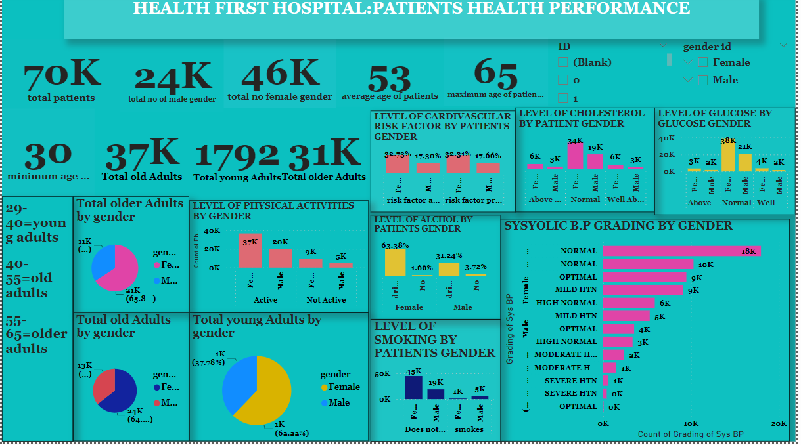

# HEALTH-FIRST-HOSPITAL-PAITENTS-HEALTH-PERFORMANCE

## DISCLAIMER:
All dataset and reports do not represent any company,institution or country but just a dummy dataset to demostrate the capabilities of powerbi

## INTRODUCTION:
HealthFirst Hospital, has presented a fascinating dataset to uncover valuable insights, so as to get descriptive analysis on the dataset that encompasses vital health measurements of their diverse patient's population.

 ## PROBLEM STATEMENT:
 Develop and implement a comprehensive Business Intelligence (BI) solution that enables tracking of key performance indicators (KPIs) to explore, visualize, and interpret the health characteristics of patients,shedding light on the factors that impact their well-being to help make inform strategic decisions and improve the quality of care provided at HealthFirst Hospital.

 ## SKILLS DEMOSTRATED:
- problem solving
- data discovery
- data cleaning and ETL
- measures and tables
- normalisation
- models
- slicers
- dashboard and data visualisation
  

  ## ANALYSIS:
- Total patients 70k
- Total male gender 24k
- Total female gender 46k e.t.c

## SUMMARIZED KEY METRICS:
- Glucose level by patient’s gender
- Smoking rate of patient’s by gender
- Cholesterol level by patient’s gender
- Level of dys .bp by patient’s gender
- Sys. Bp grading of patient by gender
- Level of alcohol of patient by gender
- Level of physical activites of patient by gender
- Level of cardiovascular risk factor of patient by gender
- Average weights counts of patient’s by gender

  ## KEY INSIGHTS:
- The male gender smoking rate is 8%, compared to the female gender that is 1%
- Count of glucose level of the female is 55%, compared to the malegender that is 30%
- Count of cholesterol level of the female gender is 48%, compared to the male gender is 27%
- Level of alcoholism of the male is 31%, compared the female is 63%
- Count of level of physical activities of the female is 52%,compared male is 28%  and much more

## FINDINGS:
- With this analysis it shows the female gender suffers more high cholesterol level than the male gender and high cardiovascular risk factor which may be as a result of high systolic and dystolic Blood pressure, high alcohol intake, and high glucose level (of which this should be looked into)
- I also discovered the female gender are more active in physical activities than the male gender, thereby keeping them in normal weight than the male gender
- The male gender also suffer high weight counts than the female gender which could be as a result of smoking.

I kindly request you to view and interact with this dashboard and provide suggestions on how I can further enhance it
